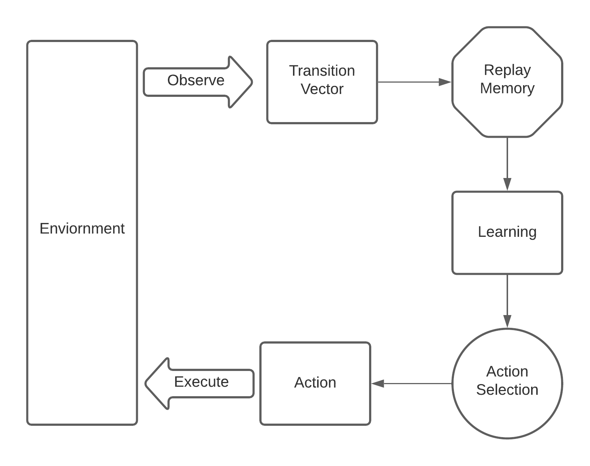

<!-- PROJECT LOGO -->
<br />
<p align="center">
  <a href="https://github.com/othneildrew/Best-README-Template">
    
  </a>

  <h3 align="center">A deep reinforcement learning agent learning to play the classical game of Tetris.</h3>
  </p>
</p>


<!-- TABLE OF CONTENTS -->
<details open="open">
  <summary>Table of Contents</summary>
  <ol>
    <li>
      <a href="#about-the-project">About The Project</a>
      <ul>
        <li><a href="#built-with">Frameworks & Technologies</a></li>
      </ul>
    </li>
    <li>
      <a href="#getting-started">Getting Started</a>
      <ul>
        <li><a href="#prerequisites">Prerequisites</a></li>
        <li><a href="#installation">Installation</a></li>
      </ul>
    </li>
    <li><a href="#usage">Run the Program</a></li>
    <li><a href="#Interpreting Output">Interpreting output</a></li>
    <li><a href="#license">License</a></li>
    <li><a href="#acknowledgements">Acknowledgements</a></li>
  </ol>
</details>


<!-- ABOUT THE PROJECT -->
## About The Project


This project serves as a submission for the course Introduction to Deep Learning Systems, Fall 2020, taught by Prof. Parijat Dube at the Courant Institute of Mathematical Sciences, New York University.

Tetris is a classic tile-matching game first introduced in 1984.

It proves to be a perfect game to empirically test Deep Reinforcement Learning (DRL) techniques and algorithms over simpler games.

In this project, we employ a DRL agent using replay memory, delineated in the following architecture. 

   
  </a>


### Built With

The project was developed using the following technologies and their respective versions:
* tensorflow v1.14.0
* tensorboard v1.14.0
* Keras v2.2.4
* opencv-python v4.1.0.25
* numpy v1.16.4
* pillow v5.4.1
* tqdm v4.31.1


<!-- GETTING STARTED -->
## Getting Started

To run the above program it is recommended to create a new working environment. (The code is not compatible with tensorflow >= 1.15 due to depreciation of the FileWriter module)

### Prerequisites

* Create a new conda environment using the following command
  ```sh
  conda create --name tetris
  ```
* Activate the new conda environment
  ```sh
  conda activate tetris
  ```
  

### Installation

 Install the specific version of all the above mentioned packages using the pip command.   
 Example      
 ```sh
 pip install tensorflow==1.14
  ```
  


<!-- USAGE EXAMPLES -->
## Run the program

Once the environment and dependencies are set up using the following command to run the program
 ```sh
 python run.py
  ```
  


<!-- ROADMAP -->
## Interpreting Output


The stdout shows the expected time of completion using the tqdm package.
OpenCV generates the simulation and visually portrays the agent interacting with the environment.

Sample Output


To monitor live performance use tensorboard using the following command:
  ```sh
  tensorboard --logdir <path-to-log-folder>
  ```

<!-- LICENSE -->
## License
No license
<!-- CONTACT -->
## Contact

**Allyn Muzhi Xu** [https://github.com/allynmuzhixu/](https://github.com/allynmuzhixu/)

**Kshitij Sanghvi** [https://github.com/kshitijsanghvi/](https://github.com/kshitijsanghvi/)


<!-- ACKNOWLEDGEMENTS -->
## Acknowledgements
[1] Watkins, C.J.C.H. (1989).Learning from delayed rewards. PhD Thesis, University of Cambridge, England.

[2] Richard Sutton and Andrew Barto. Reinforcement Learning: An Introduction. MIT Press, 1998.

[3] Mnih et al. Playing Atari with Deep Reinforcement Learning. 2013

[4] Nuno Faria. Tetris-ai [https://github.com/nuno-faria/tetris-ai]

[5] GitHub. Matris - “A clone of tetris made using pygame.” [https://github.com/Uglemat/MaTris]

[6] Stevens, Matt and Pradhan, Sabeek. “Playing tetris with deep reinforcement learning.”
http://cs231n.stanford.edu/reports/2016/pdfs/121_Report.pdf, Unpublished.


<!-- MARKDOWN LINKS & IMAGES -->
<!-- https://www.markdownguide.org/basic-syntax/#reference-style-links -->
[contributors-shield]: https://img.shields.io/github/contributors/othneildrew/Best-README-Template.svg?style=for-the-badge
[contributors-url]: https://github.com/othneildrew/Best-README-Template/graphs/contributors
[forks-shield]: https://img.shields.io/github/forks/othneildrew/Best-README-Template.svg?style=for-the-badge
[forks-url]: https://github.com/othneildrew/Best-README-Template/network/members
[stars-shield]: https://img.shields.io/github/stars/othneildrew/Best-README-Template.svg?style=for-the-badge
[stars-url]: https://github.com/othneildrew/Best-README-Template/stargazers
[issues-shield]: https://img.shields.io/github/issues/othneildrew/Best-README-Template.svg?style=for-the-badge
[issues-url]: https://github.com/othneildrew/Best-README-Template/issues
[license-shield]: https://img.shields.io/github/license/othneildrew/Best-README-Template.svg?style=for-the-badge
[license-url]: https://github.com/othneildrew/Best-README-Template/blob/master/LICENSE.txt
[linkedin-shield]: https://img.shields.io/badge/-LinkedIn-black.svg?style=for-the-badge&logo=linkedin&colorB=555
[linkedin-url]: https://linkedin.com/in/othneildrew
[product-screenshot]: images/screenshot.png
